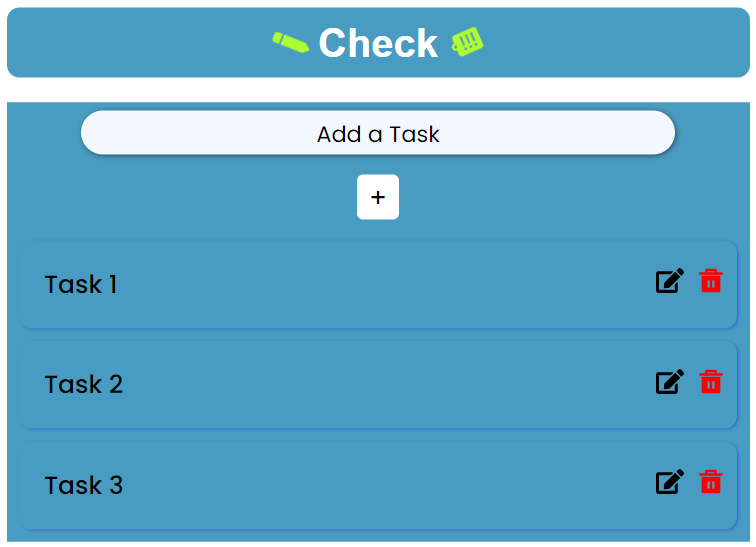
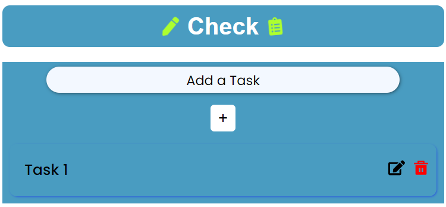
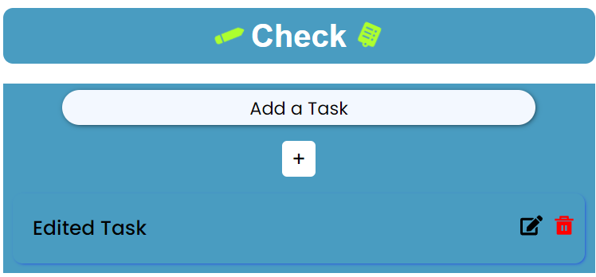

# A Todo-List App using React

## It's a Todo-List App that lets you add tasks and displays them in a table format vertically.

## And then when delete button is clicked, it will delete the task.

## And when edit button is clicked, it will edit the task and display it.

